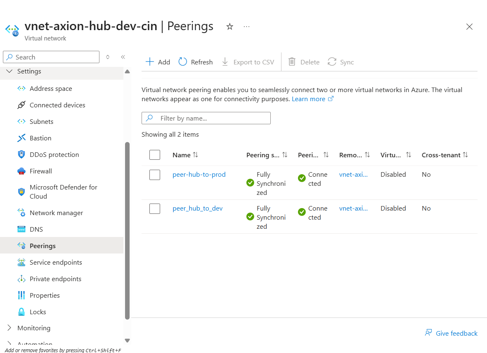
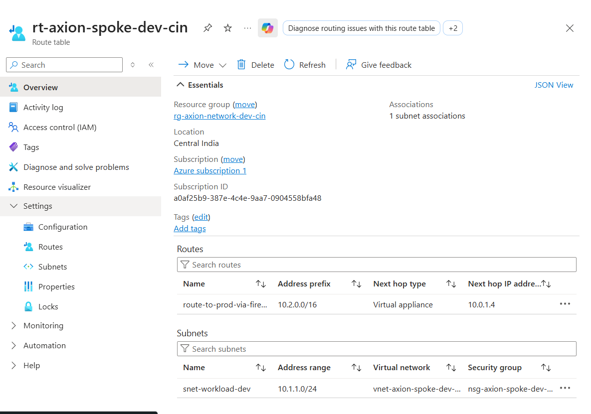
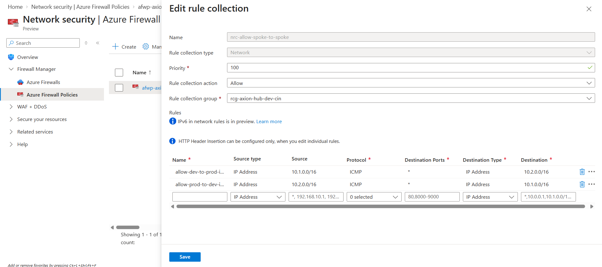

# Azure Hub-and-Spoke Network Architecture using Terraform

This project demonstrates the implementation of an Azure Hub-and-Spoke network architecture using Terraform.

The infrastructure uses a centralized Hub VNet with Azure Firewall to control traffic between Development and Production spoke networks. The spokes are not directly peered with each other. Instead, User Defined Routes (UDRs) route inter-spoke traffic through Azure Firewall, where Firewall Policy network rules control the communication.

The complete infrastructure is deployed using reusable Terraform modules.

## Architecture

The architecture consists of:

- **Hub VNet** – Provides centralized network connectivity and hosts Azure Firewall.
- **Azure Firewall** – Acts as the central network security and routing point for inter-spoke traffic.
- **Firewall Policy** – Contains network rules to control communication between the Dev and Prod spokes.
- **Dev Spoke VNet** – Contains the development workload.
- **Prod Spoke VNet** – Contains the production workload.
- **VNet Peering** – Connects both spokes with the Hub VNet.
- **User Defined Routes (UDRs)** – Route inter-spoke traffic through Azure Firewall as a virtual appliance.
- **Network Security Groups (NSGs)** – Provide subnet-level traffic filtering for the spoke workloads.

---
### High-Level Design

---
## Network Design

The network is divided into one Hub VNet and two Spoke VNets with non-overlapping address spaces.

| Network | Address Space | Subnet | Subnet CIDR | Purpose |
|---|---|---|---|---|
| Hub VNet | `10.0.0.0/16` | AzureFirewallSubnet | `10.0.1.0/26` | Azure Firewall |
| Hub VNet | `10.0.0.0/16` | AzureFirewallManagementSubnet | `10.0.2.0/26` | Azure Firewall management traffic |
| Hub VNet | `10.0.0.0/16` | Shared Services | `10.0.3.0/24` | Reserved for shared services |
| Dev Spoke | `10.1.0.0/16` | Dev Workload | `10.1.1.0/24` | Development workload |
| Prod Spoke | `10.2.0.0/16` | Prod Workload | `10.2.1.0/24` | Production workload |

### VNet Connectivity

The Hub VNet is peered with both the Dev and Prod Spoke VNets.

- Hub ↔ Dev Spoke
- Hub ↔ Prod Spoke
- No direct peering exists between Dev and Prod spokes.
- Forwarded traffic is enabled on the peerings to support traffic routed through Azure Firewall.
---
## Traffic Flow

Inter-spoke traffic is forced through the centralized Azure Firewall using User Defined Routes (UDRs).

### Dev to Prod

`Dev VM → Dev UDR → Azure Firewall → Firewall Policy → Prod VM`

- **Destination Prefix:** Prod Spoke (`10.2.0.0/16`)
- **Next Hop Type:** `Virtual Appliance`
- **Next Hop:** `Azure Firewall private IP`

### Prod to Dev

`Prod VM → Prod UDR → Azure Firewall → Firewall Policy → Dev VM`

- **Destination Prefix:** Dev Spoke (`10.1.0.0/16`)
- **Next Hop Type:** `Virtual Appliance`
- **Next Hop:** `Azure Firewall private IP`
---

## Terraform Project Structure

The Terraform configuration follows a modular structure, with reusable modules separated from environment-specific configuration.

```text
azure-hub-spoke-terraform/
│
├── environments/
│   └── dev/
│       ├── main.tf
│       ├── provider.tf
│       ├── terraform.tfvars
│       └── variable.tf
│    
│
├── modules/
│   ├── firewall/
│   ├── firewall_policy/
│   ├── firewall_policy_rule_collection/
│   ├── nic/
│   ├── nsg/
│   ├── nsg_association/
│   ├── public_ip/
│   ├── resource_group/
│   ├── route_table/
│   ├── route_table_association/
│   ├── subnet/
│   ├── virtual_machine/
│   ├── virtual_network/
│   └── vnet_peering/
│
├── .gitignore
└── README.md
```
---
## Prerequisites

Before deploying the infrastructure, ensure the following tools and access are available:

- Terraform installed
- Azure CLI installed
- An active Azure subscription
- Required permissions to create networking and compute resources in Azure
- Azure authentication configured using Azure CLI

## Deployment Workflow

Navigate to the development environment:

```bash
cd environments/dev

```
Initialize the Terraform working directory and download the required providers:

```bash
terraform init
```

Format and validate the Terraform configuration:

```bash
terraform fmt -recursive
terraform validate
```

Review the execution plan before creating any resources:

```bash
terraform plan
```

Deploy the infrastructure:

```bash
terraform apply
```

After completing the validation and testing, destroy the infrastructure to avoid unnecessary Azure costs:

```bash
terraform destroy
```
## Validation and Testing

After deploying the infrastructure, the network configuration and inter-spoke connectivity were validated to ensure that traffic was correctly routed through the centralized Azure Firewall.

### VNet Peering Validation

The Hub VNet peerings with both the Dev and Prod spoke VNets were verified in the `Connected` state.

- Hub ↔ Dev Spoke
- Hub ↔ Prod Spoke
- No direct peering exists between the Dev and Prod spokes.



### Route Validation

The route table associated with the Dev workload subnet was verified to ensure that traffic destined for the Prod Spoke is routed through Azure Firewall.

| Configuration | Value |
|---|---|
| Source Subnet | Dev Workload (`10.1.1.0/24`) |
| Destination Prefix | Prod Spoke (`10.2.0.0/16`) |
| Next Hop Type | `Virtual Appliance` |
| Next Hop IP | Azure Firewall (`10.0.1.4`) |



### Firewall Policy Validation

The Azure Firewall Policy was verified to ensure that inter-spoke traffic is explicitly controlled by firewall network rules.

The network rule collection allows ICMP traffic in both directions:

- Dev Spoke (`10.1.0.0/16`) → Prod Spoke (`10.2.0.0/16`)
- Prod Spoke (`10.2.0.0/16`) → Dev Spoke (`10.1.0.0/16`)



